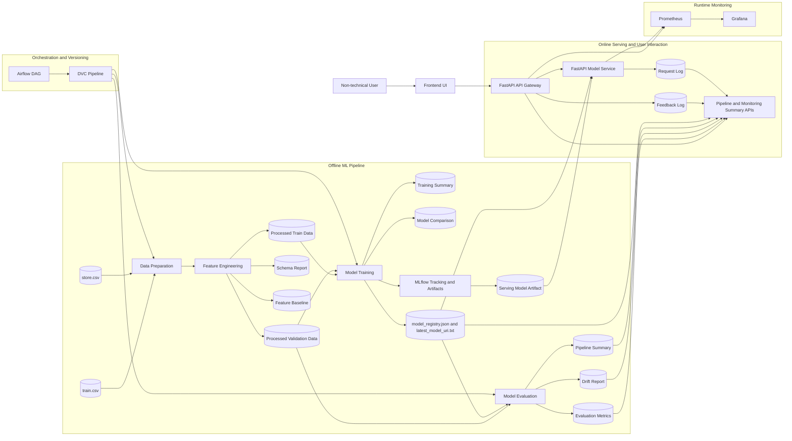

# Architecture Diagram

## Block Explanation

- `Frontend UI`: user-facing web application for forecast requests, feedback capture, pipeline visibility, and monitoring summary.
- `Raw Data Sources`: `train.csv` and `store.csv` provide the historical sales and store metadata used to build the model.
- `Data Preparation`: merges and validates the raw datasets before modeling.
- `Feature Engineering`: derives calendar, competition, promotion, and store-level features and also computes schema and drift baselines.
- `Processed Train and Validation Data`: structured datasets used by the training and evaluation stages.
- `Model Training`: trains candidate models, compares them, logs experiments to MLflow, and writes selected model metadata.
- `Model Evaluation`: evaluates the selected model on validation data and writes evaluation metrics, drift reports, and pipeline summary artifacts.
- `MLflow Tracking and Artifacts`: stores experiment runs, model artifacts, parameters, and training metrics.
- `Model Registry Metadata`: `models/model_registry.json` and `models/latest_model_uri.txt` store the selected model information used by the serving layer.
- `Serving Model Artifact`: the serialized model loaded by the online inference service.
- `DVC Pipeline`: defines the reproducible offline stages `prepare_data`, `train_model`, and `evaluate_model`.
- `Airflow DAG`: visual orchestration layer for the same offline pipeline stages and their task logs.
- `API Gateway`: receives frontend requests, proxies forecast requests to the model service, records feedback, and exposes pipeline and monitoring summary APIs.
- `Model Service`: loads the selected serving model, performs inference, detects request-level drift, and logs online prediction events.
- `Feedback Log`: stores actual sales values collected after predictions so real-world error can be computed later.
- `Request Log`: stores online inference activity such as prediction latency and drift flags for auditability.
- `Pipeline and Monitoring Summary APIs`: aggregate offline reports and online logs so the frontend can show pipeline and monitoring information.
- `Prometheus`: scrapes exporter metrics from the API gateway and model service.
- `Grafana`: sits at the end of the monitoring chain and visualizes live runtime latency, throughput, failures, drift events, and service availability.

## Demo Entry Points

- Frontend UI: `http://localhost:8088`
- API Gateway Docs: `http://localhost:8103/docs`
- Model Service Docs: `http://localhost:8101/docs`
- Prometheus: `http://localhost:9091`
- Grafana: `http://localhost:3001`
- Airflow UI: `http://127.0.0.1:8081`
