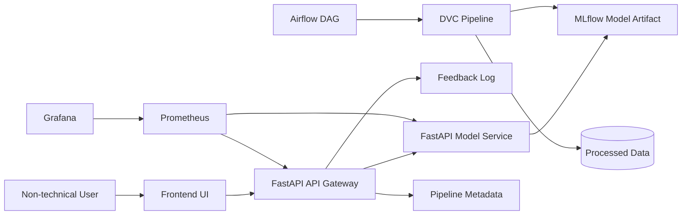

# Architecture Diagram

## Block Explanation

- `Frontend UI`: responsive web portal for forecasting, pipeline visibility, and user guidance.
- `API Gateway`: decouples the UI from model inference through REST APIs.
- `Model Service`: loads the best MLflow model and performs inference.
- `DVC Pipeline`: orchestrates data preparation, training, and evaluation stages.
- `Airflow DAG`: offline orchestration and task-log view for the data preparation, training, and evaluation pipeline.
- `MLflow`: tracks experiments, parameters, metrics, runs, and model artifacts.
- `Prometheus + Grafana`: monitor live runtime latency, requests, drift events, failures, and feedback activity.
- `Feedback Log`: stores actual sales once available for performance decay analysis.

## Demo Entry Points

- Frontend UI: `http://localhost:8088`
- API Gateway Docs: `http://localhost:8103/docs`
- Model Service Docs: `http://localhost:8101/docs`
- Prometheus: `http://localhost:9091`
- Grafana: `http://localhost:3001`
- Airflow UI: `http://127.0.0.1:8081`
